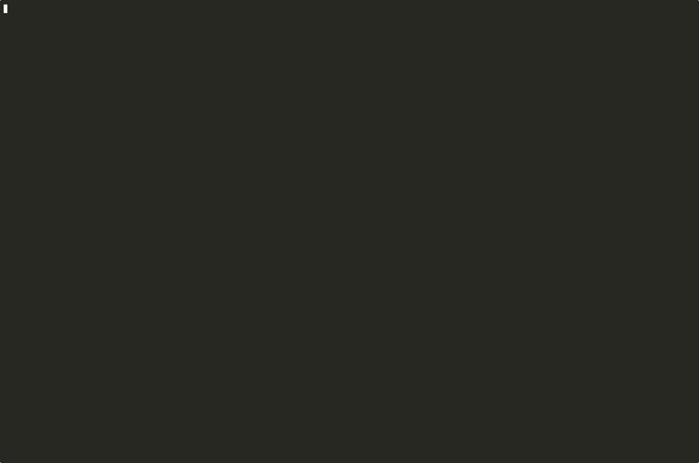

# agentenv

[](https://github.com/css521/agentenv/actions/workflows/ci.yml)
[](LICENSE)
[](https://pkg.go.dev/github.com/css521/agentenv)

A **self-hostable, rewindable virtual environment for agents** that runs even in a
locked-down Kubernetes pod (non-root, no `privileged`, no special capabilities).
The environment versions itself automatically (zero agent intrusion), can roll
back to **any node**, and can **branch** so an agent explores several approaches in
parallel branches and keeps the winner.



> Real Claude Code, running inside agentenv: it deletes `/usr/local/bin/claude`
> (its own binary, system-wide — `git` cannot undo this), then calls the
> `agentenv__checkout` MCP tool to roll the WHOLE environment back, and the
> binary is restored. The Claude session itself keeps running throughout.
> Reproducible from [`examples/claude-code/`](./examples/claude-code/); re-record
> the GIF with [`scripts/record-claude-tui.sh`](./scripts/record-claude-tui.sh).

See [`DESIGN.md`](./DESIGN.md) for the architecture.

## Install

```bash
# Default static binary (copy/rootless backend) — runs anywhere, incl. restricted pods:
go install github.com/css521/agentenv@latest

# From source:
git clone https://github.com/css521/agentenv && cd agentenv
CGO_ENABLED=0 go build -o agentenv .                 # default (rootless)
CGO_ENABLED=1 go build -tags btrfs -o agentenv .     # optional btrfs fast path
```

Prebuilt binaries are attached to each [release](https://github.com/css521/agentenv/releases).
Multi-arch container images at `ghcr.io/css521/agentenv` (`:latest` or `:vX.Y.Z`).

## Why it's different

Most agent-sandbox snapshotting is hosted SaaS on micro-VMs, needs privilege, and
only does linear undo. agentenv aims at the gap:

- **Self-hosted, runs in restricted environments** — the default build is a pure-Go
  static binary that snapshots/rolls-back **rootless** (Linux user namespaces +
  plain-copy snapshots), so it works in a restricted K8s pod. No privilege, no
  btrfs, no FUSE required.
- **Zero-intrusion auto-capture** — the agent just acts; agentenv records every
  change (shell commands *and* direct file edits) like a DVR. The agent never
  calls "commit".
- **Branch exploration as a first-class primitive** — fork the environment, try N
  approaches in separate branches, evaluate, keep the best. (See the demo.)
- **First-class MCP integration** — `agentenv mcp` is a Model Context Protocol
  server that lets Claude Code (or any MCP host) inspect history and roll back
  natively. The model gets six tools: `agentenv__head`, `log`, `branches`,
  `show`, `diff`, `checkout`. No bespoke integration needed.
- **Pluggable, degrades gracefully** — uses the fastest backend available.

## Backends (auto-detected at startup)

| Backend | Build | Needs | Snapshots | Where |
|---|---|---|---|---|
| **copy (rootless)** | default, `CGO_ENABLED=0` | nothing (userns) | reflink (FICLONE) when supported, else plain copy + hardlink sharing | restricted K8s pod, any host |
| **btrfs (privileged)** | `-tags btrfs` (cgo+libbtrfs) | root + btrfs fs | CoW subvolumes (instant) | privileged hosts/VMs |

`AGENTENV_BACKEND=copy|btrfs` forces one; otherwise the highest-priority available
backend is chosen.

## Build

```bash
# Default: pure-Go static binary, runs rootless anywhere (this is what a pod uses)
CGO_ENABLED=0 go build -o agentenv .

# Optional fast path for privileged btrfs hosts
CGO_ENABLED=1 go build -tags btrfs -o agentenv .
```

## Commands

```
# run modes
agentenv supervise -- <agent>   run an UNMODIFIED agent inside the env; auto-snapshot;
                                rollback (out-of-band) kills + restarts it  ← primary
agentenv daemon [--socket p]    serve the JSON API over a unix socket (for orchestrators)
agentenv mcp [--socket p]       MCP server over stdio (Claude Code & other MCP hosts)
agentenv shell                  interactive shell inside the env (human/debug)
agentenv exec -- <cmd...>       run one command in the env (scripting/CI)

# out-of-band client (talks to a running daemon/supervise, no repo lock needed)
agentenv ctl <op> [args]        log | head | branches | exec | checkout | diff | ...

# setup / history / inspection
agentenv init --from <dir|/> | --tarball <path|URL>
                                seed root from an existing dir, or extract a tar(.gz)
agentenv commit -m "msg"        manual snapshot (auto-capture usually does this)
agentenv checkout <ref>         roll the whole env back to any node (accepts tag/prefix)
agentenv tag [name] [ref]       list/get/set named refs (e.g. tag winner <id>)
agentenv tournament --base <ref> --test "<cmd>" -- "cand1" "cand2" ...
                                fork base, run each candidate, keep first that passes test
agentenv status                 one-screen runtime summary (backend, HEAD, disk, limits)
agentenv log | head | branches  view the commit-DAG / HEAD / branch tips
agentenv show <ref> | diff <a> <b>      what changed (confirm a change / rollback)
agentenv gc                     reclaim disk from sparsified snapshots

Env: AGENTENV_ROOT (default /agentfs), AGENTENV_SOCKET, AGENTENV_BACKEND,
     AGENTENV_KEEP_RECENT, AGENTENV_IGNORE.
```

## Running your agent transparently (zero changes)

The agent runs **unmodified** — any command, any language (Go/Java/Python/…), any
path — inside the managed environment, which is auto-snapshotted. The agent calls
no API and is unaware of agentenv; you only wrap how it's *launched*.

Wrap any agent image with [`Dockerfile.control`](./Dockerfile.control):

```bash
# Build the static binary first:
$ CGO_ENABLED=0 go build -o agentenv .
# Then bake it into your agent image and run:
$ docker build -f Dockerfile.control --build-arg BASE=<your-agent-image> -t my-agent-rewindable .
$ docker run --security-opt seccomp=unconfined my-agent-rewindable <your agent command>
```

Its entrypoint runs `init --from /` (managed env = the whole container fs, one-time
copy; later snapshots are cheap diffs) then `agentenv supervise -- <agent>`:
auto-capture records everything the agent does. Rollback is **out-of-band** (a
sidecar/orchestrator sends `{"op":"checkout","node":"<id>"}` to the socket); the
agent is killed and relaunched from the restored environment.

> Capture is filesystem-level, so it's **language-agnostic** — `go build`,
> `mvn package`, `pip install`, etc. are all snapshotted the same way. Drive
> rollback from any language via the socket or the CLI (see `examples/`).

You cannot have *fully transparent + whole-system rollback* with the agent on the
raw container rootfs in an unprivileged pod — the agent must run inside the managed
rootfs (above), or you need a VM/CSI-snapshot backend.

### Kubernetes

See [`examples/k8s/`](./examples/k8s/) for a ready-to-use unprivileged Pod manifest
(no `privileged`, no caps; needs unprivileged user namespaces + `Unconfined`
seccomp) and the out-of-band rollback workflow:

```sh
kubectl exec my-agent -- agentenv ctl log
kubectl exec my-agent -- agentenv ctl checkout <node-id>   # roll the whole env back
```

## Agent integration (socket API)

`agentenv daemon` serves a newline-delimited JSON protocol over a unix socket, so
an agent harness drives the environment programmatically and gets structured
results — crucially, the **snapshot node id produced by each command**, which it
can later `checkout` or branch from.

`exec` **streams** output as it's produced (so a 10-minute `make` doesn't go
silent for 10 minutes), then ends with a terminal frame:

```
→ {"op":"exec","cmd":"make"}
← {"stdout":"compiling foo.go\n"}
← {"stdout":"compiling bar.go\n"}
← {"stderr":"warning: unused\n"}
← {"ok":true,"exit":0,"node":"ab12cd34ef56","head":"ab12cd34ef56"}

→ {"op":"checkout","node":"<id>"}    → {"op":"log"}    → {"op":"branches"}
→ {"op":"diff","a":"x","b":"y"}      → {"op":"tournament","base":"...",...}
→ {"op":"tag","name":"winner","ref":"<id>"}
```

Clients keep reading frames until they see `"ok":true` or `"error":"..."` — see
`examples/branch_explore.py` for the streaming client pattern.

## MCP (Claude Code & other MCP hosts)

`agentenv mcp` is a Model Context Protocol server over stdio. It exposes six
tools — `agentenv__head`, `log`, `branches`, `show`, `diff`, `checkout` —
that bridge directly to a running `agentenv daemon`. The agent in Claude Code
can ask "where am I in history?" and "undo to that node" without any custom
integration. Schemas are inferred from typed Go structs via the official
`modelcontextprotocol/go-sdk`, and tool errors carry a deliberate
anti-hallucination prefix so the model can't quietly fabricate a result after
a failed call.

Typical setup:

```bash
# 1) Start the daemon once (somewhere the rootfs has been initialized).
$ agentenv daemon &

# 2) Register the MCP server with Claude Code.
$ claude mcp add agentenv -s user -- agentenv mcp
```

Then prompt the model: *"use `agentenv__log` to find the last good node and
`agentenv__checkout` to roll back to it."* The rollback is real — it reverts
the whole rootfs, not just a HEAD pointer.

Two reproducible Docker harnesses verify the chain end-to-end:

- `verify/docker/mcp-smoke.sh` — drives `agentenv mcp` with hand-crafted
  JSON-RPC and asserts the SDK handshake + tools/list + each tool call.
- `verify/docker/rollback-smoke.sh` — mutates the rootfs, fires
  `agentenv__checkout` over MCP, asserts the files actually go and come back.

[`examples/branch_explore.py`](./examples/branch_explore.py) is a ~60-line agent
that forks the env, tries 3 candidate approaches **in parallel** (each in its own
isolated workspace built via reflink/btrfs snapshot), and keeps the one that
passes the test — entirely over the socket. The same primitive is exposed as the
`agentenv tournament` command:

```sh
agentenv tournament --base good --keep --test '<verify cmd>' -- \
  'sleep 3 && build candidate A' \
  'sleep 3 && build candidate B' \
  'sleep 3 && build candidate C'
# wall-clock ≈ 3s for 3 × 3s candidates — truly parallel.
```

## Rollback semantics

Rollback reverts the **filesystem and installed dependencies**; the **agent loop
survives** (it lives outside the environment), and **other processes are killed**
(no process-memory restore; no CRIU).

## Verify it yourself (Docker)

The core E2E suite (auto-capture, rollback, branch tournament) is in
`scripts/`, driven via the Makefile:

```bash
make verify-rootless     # rootless E2E: uid 1001, no --privileged
make verify-supervise    # supervise + out-of-band ctl rollback
make verify-btrfs        # privileged btrfs path (-tags btrfs)
```

The MCP path has its own dedicated harness under `verify/docker/`:

```bash
# Cross-compile the binary into the build context first:
$ GOOS=linux GOARCH=arm64 CGO_ENABLED=0 \
    go build -o verify/docker/agentenv-linux-arm64 .

# Protocol-level: drives `agentenv mcp` with real JSON-RPC and asserts the
# SDK handshake + tools/list + every tool call.
$ docker build --platform=linux/arm64 -f verify/docker/Dockerfile.mcp-smoke \
    -t agentenv-mcp-smoke verify/docker/
$ docker run --rm --platform=linux/arm64 agentenv-mcp-smoke

# End-to-end: mutates the rootfs, fires `agentenv__checkout` over MCP,
# asserts the files really roll back both ways.
$ docker build --platform=linux/arm64 -f verify/docker/Dockerfile.rollback-smoke \
    -t agentenv-rollback-smoke verify/docker/
$ docker run --rm --platform=linux/arm64 \
    --security-opt seccomp=unconfined --security-opt apparmor=unconfined \
    agentenv-rollback-smoke
```

For an interactive Claude Code session driving agentenv via MCP, see
`verify/docker/run-claude-shell.sh`.

## Layout

```
main.go / main_other.go  CLI entry (Linux) + friendly stub (other OS)
internal/cli             command registry + handlers + ctl client
internal/mcp             MCP server bridging Claude Code to the daemon socket
internal/daemonclient    in-process daemon-socket client (shared by ctl + mcp)
internal/repo            orchestrator: DAG + auto-capture + retention + tournament
internal/backend         Runner/Snapshotter interfaces + capability probe
                          copy.go (rootless, default) + btrfs_backend.go (-tags btrfs)
internal/api             newline-JSON socket protocol (server)
internal/protocol        shared wire types (server + clients)
internal/sandbox         namespace + pivot_root runner (+ PTY)
internal/dag             commit-DAG metadata (JSON), portable
internal/image           seed-from-dir / extract-tarball, portable
internal/watch           inotify recursive watcher
internal/btrfs           btrfs SDK wrapper (cgo, -tags btrfs only)
scripts/                 verify-rootless.sh, verify.sh, verify-supervise.sh,
                          agentenv-entrypoint.sh; record-claude-tui.sh +
                          fetch-recording-tools.sh + Dockerfile.recorder (GIF tooling)
verify/docker/           mcp-smoke.sh, rollback-smoke.sh, claude-shell-*
examples/                claude-code/, k8s/, branch_explore.py, goclient/, Client.java
```

## Developing on macOS / Windows

agentenv's runtime is Linux-only on purpose (user namespaces, pivot_root, btrfs).
Running `go build .` on a Mac produces a stub binary that prints a friendly
pointer instead of failing cryptically. To actually develop and test changes:

| You want | Do |
|---|---|
| **Edit on Mac, run on Linux** (recommended) | [OrbStack](https://orbstack.dev): `brew install orbstack && orb create ubuntu agentenv-dev`, then connect Cursor / VS Code via **Remote-SSH** to `agentenv-dev.orb.local` — full Linux Go tooling, `dlv debug`, fast bind mount. |
| **No VM, just IDE that understands the code** | Add `.vscode/settings.json` with `"go.toolsEnvVars": { "GOOS": "linux", "GOARCH": "amd64" }` — gopls now indexes the Linux-only files; build/test still happens via Docker. |
| **One-click reproducible dev env** | Add a `.devcontainer/devcontainer.json` and "Reopen in Container" — Linux Go env every contributor shares. |
| **Quick verify only, no setup** | `bash scripts/verify-rootless.sh` runs the rootless E2E in a Docker container as uid 1001 with no privileged. |
| **CI is the source of truth** | Pushing a branch runs the full matrix via `.github/workflows/ci.yml`. |

### Common commands (`Makefile`)

```sh
make help              # list every target with a description
make build             # cross-compile a Linux static binary → bin/agentenv-<arch>
make test              # unit tests (race-enabled, runs on macOS too)
make vet               # gofmt check + go vet
make verify-rootless   # full E2E: rootless / uid 1001 / no --privileged
make verify-btrfs      # full E2E: privileged btrfs path (-tags btrfs)
make verify-supervise  # supervise + ctl rollback end-to-end
make dev-shell         # drop into a persistent Linux dev container (fast iteration)
```

The first time `go build .` runs on a Mac you get a friendly stub binary that
explains how to actually try agentenv (Docker one-liner) — no cryptic "no Go
files" error.

## Status & limits

Working & verified end-to-end (both backends) in Docker. Honest boundaries:

- **Not for untrusted code.** Rootless gives isolation, not a security boundary
  against hostile binaries — run those behind a VM/microVM.
- Change detection is event-driven (inotify), so idle has no polling cost; a
  periodic Token() check is kept as a backstop. Snapshots cost O(changed) data,
  and restore (checkout) copies only the diff.
- Ephemeral paths are not snapshotted (`AGENTENV_IGNORE`, default `tmp,var/tmp,var/cache`).
- No process-memory rollback (FS + deps only).
- Single base image (`ubuntu`); or seed any rootfs with `init --from`.
