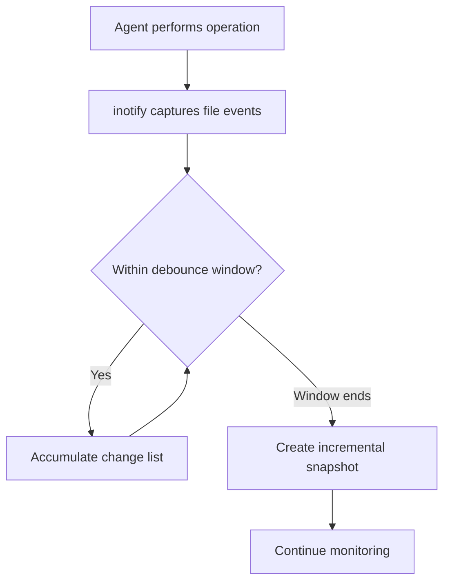
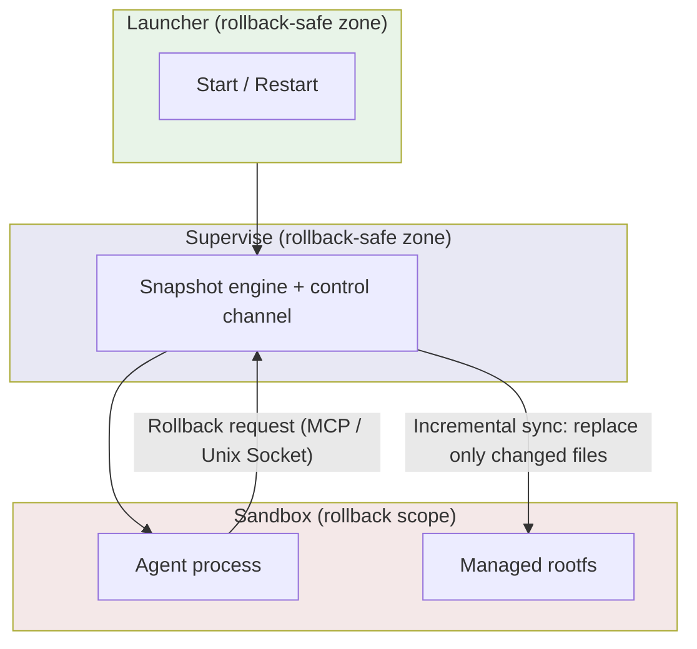
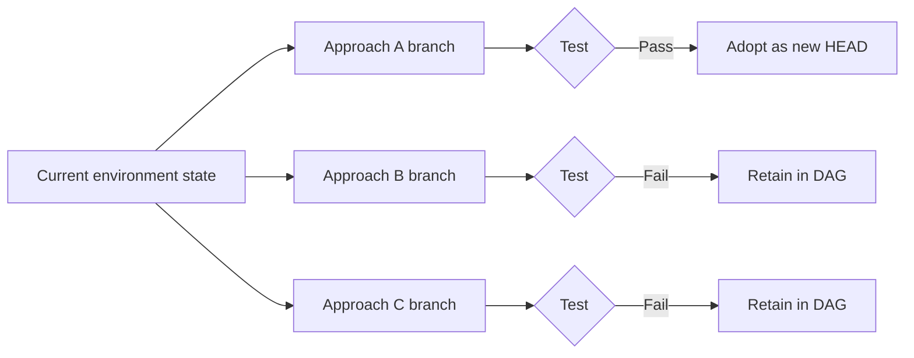

# In the Age of Agents, It's Not the Model That Breaks First — It's the Environment

Over the past decade, cloud-native infrastructure solved one core problem: **spatial isolation** — keeping different workloads on the same physical machine from interfering with each other. Namespaces, cgroups, containers, micro-VMs — they all do fundamentally the same thing.

But when AI Agents become the primary operators of environments, a new problem emerges: what an Agent needs most isn't isolation from other workloads, but the ability to go back to a previous state after it has broken things.

Strictly speaking, this isn't "isolation" — isolation prevents mutual interference; what we need here is the ability to rewind after the fact. But both serve the same purpose: making sure a single operation doesn't cause irreversible damage. So allow me a slightly imprecise parallel: spatial non-interference, **temporal reversibility**. The latter is the piece cloud-native hasn't really touched in the past decade.

Git solved the rewind problem at the code level. But the ways Agents break environments are almost never about modifying code files. They install the wrong system packages, corrupt global configurations, accidentally delete runtime dependencies. These changes are scattered across the entire filesystem, and no existing tool tracks them.

The observations below come from pitfalls we encountered while building the Aone Agent project.

This article aims to discuss: how this gap came about, why existing solutions can't fill it, and what problems — unique to the Agent scenario — we encountered when trying to fill it ourselves.

---

## What Existing Solutions Actually Solve

Let's start by acknowledging a fact: the industry hasn't been blind to the environment safety problem for Agents. Current approaches fall roughly into two categories.

**The first is behavioral constraints**: limiting risky operations through Prompt rules, narrowing scope through permissions, intercepting critical commands through approval workflows. The logic is "make the Agent mess up less often."

**The second is sandbox isolation**: confining the Agent inside a VM or sandbox — if it breaks things, just rebuild. E2B uses Firecracker micro-VMs to achieve memory-level snapshots, and it's the best product in this direction.

Both categories are effective, but they solve different problems:

| Approach | What It Solves | What It Doesn't |
|---|---|---|
| Behavioral constraints (Prompt/permissions) | Reduces error frequency | No recovery after errors |
| Sandbox isolation (VM/container) | Blast radius control | No state rollback within the environment |
| VM snapshots (E2B/Morph) | Environment-level snapshot + rollback | Requires specific infrastructure |

E2B's solution comes closest to complete — it both isolates and allows rollback. But it assumes you're on their cloud, or that your environment has `/dev/kvm`. This isn't E2B's fault; it's an inherent constraint of the micro-VM approach.

Here's the question: **in environments that don't meet these prerequisites, the Agent's environment rollback capability drops to zero**.

---

## What Blocks Every Solution Is the Underlying Assumptions

Line up the existing environment rollback approaches, and a pattern emerges:

| Technology | Rollback Capability | Prerequisites |
|---|---|---|
| Firecracker micro-VM | Memory-level snapshots | /dev/kvm or vendor cloud |
| btrfs / ZFS subvolume snapshots | Filesystem-level CoW | Root + specific filesystem |
| Docker checkpoint | Container-level | Docker daemon + CRIU + root |
| CRIU process freezing | Process + memory | Root + CAP_SYS_PTRACE |
| Git | File-level | Only tracks managed files |

Each has clear capabilities, but each is also bound to specific infrastructure assumptions.

In a standard Pod on an enterprise K8s cluster, almost none of these assumptions hold — non-root user (uid 1001), no privileged mode, no /dev/kvm, overlay filesystem rather than btrfs. This isn't ops being lazy; it's the baseline requirement of CIS Benchmark, PCI DSS, and other security standards.

CNCF's 2023 survey shows that 84% of organizations are either using Kubernetes in production or actively evaluating it. Of course, "organization uses K8s" doesn't equal "Agents run in security-hardened restricted Pods" — many Agents probably run on dedicated VMs or nodes with relaxed permissions. But it's reasonable to infer that **a significant portion of enterprise Agents will land in these restricted environments**, where none of the existing rollback solutions apply.

This gap isn't a feature missing from some product — it's a structural void in the infrastructure stack. Existing solutions were designed for privileged human operators: humans have root, can choose filesystems, can decide which virtualization technology to use. **When the operator changes from human to Agent, the implicit assumption of "having privileges" no longer holds.**

---

## How Three Constraints Shape the Solution

The first two sections established the direction: we need filesystem-level version control in an unprivileged environment. But direction isn't a solution. Between direction and solution, three constraints form a derivation chain — each narrows the design space one step further. To be clear: at each step there were other choices; we picked the one with the lowest cost under the constraints. Writing it as a "derivation" is for narrative clarity — it doesn't mean there's only one possible answer.

### 3.1 Who Triggers the Snapshot — The Agent Won't Cooperate

The most natural idea is to give the Agent a `save` tool and have it manually checkpoint before critical operations. But this approach has two problems. First, "which operation is dangerous" is context-dependent: `rm -rf build/` is harmless in a clean repo but catastrophic in the wrong directory; `pip install` is normally safe but becomes an incident when it overwrites a system package. The Agent doesn't have complete state information at execution time, so expecting it to proactively save before dangerous operations isn't reliable. Second, and more practically: third-party Agents (like Claude Code) aren't our code — we can't require them to call a checkpoint API.

If the Agent won't cooperate, snapshots must be automated by the infrastructure. Technically, we use inotify to recursively register a watch for each directory, monitor filesystem changes, and use debounce strategies to merge a single logical operation (like `go build` producing hundreds of file events in an instant) into a single snapshot.

This locks in the first technical choice: **automatic capture, transparent to the Agent**.

### 3.2 Where Does Auto-Capture Run — No Root Available

Auto-capture requires building an isolated rootfs environment (mount, pivot_root), and the analysis in Section II shows the target environment has no root privileges.

Without root, the available options are limited: FUSE requires `/dev/fuse` (not necessarily available in restricted Pods), a privileged sidecar defeats the zero-privilege goal, and what's left is Linux User Namespaces — an ordinary process can obtain isolated uid mapping in a user namespace it creates (still uid 1001 externally, root internally). This is just enough privilege to execute mount and pivot_root, requiring no privileged mode, no SYS_ADMIN, no special filesystem — directly usable in standard K8s Pods. It's not the only option, but it's the one with the lowest cost under these constraints.

Second technical choice locked in: **User Namespace for unprivileged isolation**.

### 3.3 Can Auto-Capture Frequency Be Sustained — Incremental Is the Cheapest Path

The first two choices combined produce a new problem: auto-capture means high-frequency snapshots (potentially triggered on every Agent operation), and a rootfs is several gigabytes. Full copies every time would exhaust disk and IO quickly.

Several paths are available: periodic full copies with compression — still has periodic large overhead; copy-on-write (CoW) filesystems — ties us back to specific filesystems, falling into the prerequisite trap from Section II; or storing only diffs. We chose the last — unchanged files are hardlinked to the previous snapshot (just a new directory entry, sharing the same data blocks, no content copied — extremely low overhead), and only modified files are copied. Snapshot cost is proportional to "how much changed," not "how large the environment is."

The incremental design was initially just about solving the performance problem, but we later discovered it simultaneously unlocks a more critical capability: **rollback also only needs to replace the files that differ**. This means the Agent process's binary and runtime memory are unaffected — no process restart needed. With full replacement, the Agent process would inevitably be killed. This property becomes crucial in the next section.

---

## Self-Rollback: A Question Deeper Than Technology

Externally triggered rollback (human notices problem → manual revert) works fine in many scenarios. But in practice, we repeatedly observed a phenomenon: the Agent often knows it messed up.

In its reflection after a failed command, the model frequently says things like "my previous operation was wrong, I should go back to the earlier state." It has the intent to roll back, but not the ability. The result is continued patching on the broken environment, making things progressively worse.

Behind this lies a question about **the boundary of Agent autonomy**: if our goal is to let Agents run complex tasks autonomously, then "the Agent can't control its own runtime environment" is a structural capability deficit. Autonomy requires a closed loop — perception, decision-making, execution, and error correction all within the Agent's control. If environment recovery must depend on external human intervention, that loop is broken.

But self-rollback introduces a hard constraint: when rollback is initiated by the Agent itself, and we want it to continue working afterward, **rollback cannot kill the Agent process itself**.

An Agent that has run twenty rounds of dialogue has accumulated task goals, attempted approaches, failure reasons, and current thinking in its context. If rollback restarts the process, all that context is lost. A broken environment can be reverted; lost context means starting from scratch.

This constraint means the snapshot engine must be outside the rollback scope — otherwise rollback would take the engine down with it. And the Agent needs some channel to proactively initiate rollback requests. "Controller outside rollback scope" and "Agent can issue requests across the boundary" — these two requirements together derive a layered architecture:

The snapshot engine and control channel sit outside the rollback scope. In self-rollback mode, rollback only touches the filesystem inside the Sandbox, via incremental sync — only replacing files that differ. The Agent process doesn't restart; context is fully preserved. To be clear: this is specific to the Agent self-rollback scenario. When rollback is triggered by an external operator (human or orchestration system), the default path is still kill-and-restart — because external operators don't need to preserve Agent context, and a clean restart is safer.

There's a detail worth expanding here: from an OS perspective, if the Agent process holds file descriptors to replaced files or has cached stale state in runtime (like Python's `sys.modules`), hot file replacement could cause memory state to diverge from the filesystem. The reason this doesn't pose a practical obstacle in the Agent scenario is that the execution model of LLM-driven Agents provides a natural safety boundary: the Agent's work loop is "call tool → read output → decide next step," re-reading environment state through tool calls each round, never holding long-lived file handles across operations. Rollback happens between two tool calls, and the Agent naturally reads the new file contents on the next round.

The key insight of this architecture isn't the "three layers" themselves, but the judgment behind them: **in Agent systems, runtime context is more valuable than environment state**. This priority dictates that rollback must be non-destructive.

---

## When the Operator Shifts from Deterministic to Probabilistic

The preceding sections addressed capability problems — achieving filesystem-level snapshots, rollback, and Agent self-control in an unprivileged environment. But when Agents begin using these capabilities at high frequency, a different class of problems emerges: existing infrastructure's interface contracts are designed for deterministic callers, and **when the caller becomes a probabilistic LLM, the contracts themselves begin to break down**.

### 5.1 The Error-Handling Contract Breaks

(This might seem unrelated to environment rollback, but it's actually on the same chain: rollback itself is a tool call — if the model can't even register "rollback failed," self-rollback becomes unreliable. So this isn't a tangent for us.)

Traditional tool error returns are designed for deterministic callers: functions return error codes, callers handle them with branching logic. The implicit assumption is that **the caller will rationally process every return value**.

LLMs don't work this way. They're autoregressive generators — the probability distribution of the next token is influenced by all preceding tokens in the context. A phenomenon we've observed: when the previous several tool calls in context all succeeded, even if one returns a clear error message, the model may still generate "operation successful" continuation text. One possible explanation is that the success pattern forms a strong statistical prior in the context, overwhelming the signal from a single error return — but this causal mechanism hasn't been rigorously experimentally verified; it's more an inference from behavioral observation.

This isn't solvable with Prompts. Prompts have strong control over the model at the "decide whether to call a tool" stage, but at the "interpret tool return values" stage, autoregressive momentum dominates.

Generalizing: **every system that exposes tools to LLMs faces this interface contract mismatch.** In our exploration of Agent environment management, we made a preliminary attempt: forcibly adding structured interruption signals to tool error returns (roughly "the tool did not execute, do not fabricate results, report this error verbatim"), trying to hard-insert a reminder at the point where the model is most prone to inertial hallucination. This reduced the error-ignore rate in practice, but it's far from a complete solution — it's fundamentally still using natural language to try to constrain probabilistic generation, with effectiveness depending on the specific model and context length. A more fundamental solution likely requires defining dedicated error semantics at the tool protocol level (e.g., MCP), letting the model perceive anomalies at the architectural level rather than the semantic level. This is a direction the entire Agent tool ecosystem needs to explore together.

### 5.2 The "Record Everything" Assumption Breaks

The initial design philosophy for auto-capture was "record everything, retrieve when needed." This is reasonable in deterministic systems — the more complete the logs, the better; just filter with tools when debugging.

But Agents don't review their operation history with grep — they put the history node list into context for the model to understand. When the history is cluttered with editor temp files, Agent state files, and meaningless snapshots from package manager caches, **noise doesn't just waste disk — it directly degrades the model's decision quality**. The Agent can't identify critical branch points amid a screen full of noise, leading to rollback to the wrong node.

This is a fundamentally different problem from "too many logs" in traditional systems. In traditional systems, log noise increases search time. In Agent systems, noise degrades **decision accuracy**. Signal-to-noise ratio shifts from an operational metric to a functional metric.

### 5.3 The Storage Growth Rate Assumption Breaks

Human operators interact with environments at a frequency of a few to a few dozen times per day. Snapshot storage strategies designed for this frequency (e.g., keep N checkpoints per day) work perfectly fine.

Agents operate at a frequency of dozens to hundreds of times per hour. A day's auto-snapshots can accumulate hundreds of nodes. Keeping everything exhausts disk; simply keeping the most recent N may lose critical branch points.

We borrowed from DVR (Digital Video Recorder) sparse retention strategies: keep everything recent, exponentially thin out older snapshots, never delete branch points or user-marked nodes. When cleaned-up nodes are removed, their children automatically reattach to the parent, keeping the DAG structure connected.

These three problems may seem independent, but they all point to the same judgment: infrastructure for Agents cannot be a copy of existing designs. The underlying assumptions of error communication, information presentation, and resource management all need to be redesigned for probabilistic callers.

---

## What Rollback Capability Changes

So far, the article has been discussing "how to make Agent environments rollbackable." But the more interesting question is: **when environment rollback becomes a default capability, how does the way we use Agents change?**

The most immediate change is that **the logic of risk assessment changes**.

When environments can't be rolled back, every instruction given to an Agent requires evaluating "what if it messes up." This leads to two extremes: either giving the Agent very conservative permissions (limiting capability), or spending enormous human effort on cleanup after incidents (high cost). Many teams are stuck oscillating between these extremes, fundamentally because **the cost of errors is too high, and errors are inevitable**.

Environment rollback reduces the cost of errors from "rebuild the environment" to "roll back to the last snapshot." This isn't a quantitative change — it's qualitative. It turns "let the Agent try boldly" from a reckless gamble into a rational strategic choice.

At a deeper level, rollback capability unlocks an entirely new working mode: **environment-level branch exploration**.

Git branches let developers explore multiple code paths simultaneously, picking the best one to merge into mainline. The same logic applies at the environment level — fork multiple copies from the current environment state, try different approaches in each, and use test results to decide which to keep. We implemented this pattern in agentenv as tournament mode:

This isn't a nice-to-have feature. For Agents, trial-and-error is the fundamental working mode, not an exceptional situation. **When trial-and-error can be parallelized, and failed branches don't pollute the mainline, the Agent's problem-solving efficiency undergoes a fundamental shift** — from linear trial-and-error (try one → fail → rollback → try next) to parallel exploration (try N simultaneously → keep the best).

This kind of change has no direct counterpart in human engineers' workflows — git worktree and CI matrices are rough approximations, but humans don't actually open three environments simultaneously, install three different approaches, and pick the one that works. The cost is too high. For Agents, though, this is a natural way of working — provided the infrastructure supports environment-level branching and merging.

---

## A Bigger Question

Environment version control is a specific gap, but it points to something larger: **the design assumptions of the existing infrastructure stack are systematically incompatible with AI Agents as operators**.

These assumptions include at least four:

| Implicit Assumption | Human Operators | AI Agents |
|---|---|---|
| Operation frequency | A few to dozens per day | Dozens to hundreds per hour |
| Operation predictability | Planned, approved | Trial-and-error, unpredictable |
| Error handling | Read logs → human judgment → manual recovery | Autoregressive generation → may ignore errors → needs autonomous recovery |
| Permission model | Has root = trusted | No root, can't be trusted, but needs operational capability |

Environment version control is the gap exposed by the failure of assumptions one and two. The interface contract issues discussed in Section V are manifestations of assumption three failing. The fourth — the permission model — may be the most far-reaching: existing infrastructure's security model is built on "those with permissions know what they're doing," while Agents are precisely "callers with operational needs who don't necessarily know what they're doing."

These four assumptions don't fail independently — they're chain-linked. High operation frequency necessitates automated snapshots (humans can't keep up); unpredictability means snapshots must cover everything indiscriminately (you don't know which operation will cause problems); autonomous recovery requires tool interfaces redesigned for probabilistic callers (traditional error handling is unreliable for LLMs); lack of privileges requires the entire mechanism to work without root (you can't sacrifice the security baseline for management capability).

This means Agent infrastructure isn't just "adding a layer" to the existing stack. **From interface contracts to information presentation to resource management, every level needs to re-examine the default assumption that "the operator is human."** Environment version control is just the first exposed, most easily validated facet of this systemic problem.

Monitoring and alerting is another example: existing alert systems assume the recipient is human (see alert → judge severity → decide action). When the recipient becomes an Agent, the format, priority expression, and context payload of alerts all need redesigning. Deployment pipelines too: CI/CD assumes triggers are deterministic code commit events. When triggers become Agent trial-and-error behavior, the pipeline's rate limiting, failure rollback strategies, and resource allocation all need adjustment.

These problems haven't been systematically raised, let alone systematically solved. A question worth asking is: **why?**

### 7.1 Why the Mismatch Has Persisted

One important reason is **community separation**. The people building cloud-native infrastructure (CNCF, K8s community, SRE groups) and the people building AI Agents (ML researchers, Agent framework developers) are essentially two non-overlapping circles.

The cloud-native community cares about "how to reliably run workloads." Workloads are black boxes to them — whether it's a web service or an AI Agent, the scheduling, isolation, networking, and storage requirements appear fundamentally the same. The Agent community cares about "how to make models complete tasks more intelligently." Infrastructure is a black box to them — as long as the environment runs, that's enough; what happens when the environment breaks is ops' problem.

**Both sides optimize within their own abstraction layers; nobody is examining the interface between them.** Environment version control happens to fall in the gap between these interfaces — it's neither a pure infrastructure problem (you need to understand Agent behavior patterns to design it) nor a pure AI problem (you need systems programming ability to implement it).

Another reason is that **Agent autonomy isn't high enough yet — the pain hasn't gotten bad enough**. Most Agents today are still used in human-in-the-loop mode: human gives instructions, Agent executes, human checks results. In this mode, humans can intervene manually when the environment breaks — it's painful, but tolerable. But as Agents move from Copilot mode to autonomous mode (Agent plans, executes, and self-corrects), the frequency of human intervention will drop rapidly, and the absence of environment recovery capability will shift from "occasional inconvenience" to "systemic bottleneck."

### 7.2 What Can Be Distilled from Exploring Agent Environment Management

Looking back at the design decisions discussed in previous sections, several principles keep recurring. They may apply to broader Agent infrastructure design:

**Recovery over prevention.** Probabilistic systems will inevitably make errors — this is a statistical law, not an engineering deficiency. Rather than investing infinite effort to reduce the error rate, reduce the cost of errors to a low enough level. This is the same mindset as "design for failure" in distributed systems, except the failure source has shifted from hardware and networks to probabilistic model outputs.

**Zero intrusion is a hard constraint, not a preference.** The Agent ecosystem is rapidly fragmenting — Claude Code, Devin, Cursor, custom Agents all have their own architectures. Any solution requiring Agent-side cooperation will face N Agents × M requirements combinatorial explosion at integration time. Infrastructure must fulfill its responsibilities unilaterally, without assuming the other side will cooperate.

**Information presentation affects decision quality.** This is the most easily overlooked principle. Traditional infrastructure's information output is designed for human consumption (logs, dashboards, alert emails), with "completeness" as the design goal. But Agents consume information differently — information entering the context window directly influences the model's next decision. Excessive noise doesn't just waste tokens; it systematically degrades decision accuracy. **For Agent-facing interfaces, signal-to-noise ratio is a functional metric, not an experience metric.**

**Frequency changes architecture.** At human operation frequencies, many design problems don't exist — full snapshots work fine, linear logs work fine, daily cleanup works fine. Agent operation frequencies break all of these "good enoughs." Incremental snapshots, noise filtering, sparse retention — these aren't optimizations; they're survival requirements at the new frequency. An analogy: batch processing systems and real-time systems don't have the same architecture — not because they process different data, but because the frequency is different.

### 7.3 How This Problem Will Evolve

Agent autonomy is progressing along a clear path:

- **Copilot phase** (current mainstream): Human gives instructions, Agent executes single-step operations, human checks each result. Environment breaks → human fixes it — painful but bearable.
- **Autonomous Agent phase** (arriving now): Agent accepts high-level tasks, plans and executes multi-step operations, self-corrects on errors. If it can't autonomously recover from environment breakage, the task is interrupted — starting to affect availability.
- **Multi-Agent collaboration phase** (embryonic): Multiple Agents work in the same or related environments, needing to isolate each other's impacts, share certain state, and coordinate environment changes. Environment management complexity shifts from single-Agent "linear history" to multi-Agent "interleaved DAGs" — existing infrastructure is completely unprepared for this.

Each step forward makes the four assumption mismatches discussed in this article more severe. The Copilot phase's pain point is "manual recovery is too slow." The autonomous Agent phase's pain point is "nobody's there to recover anymore." The multi-Agent phase's pain point is "we don't even know what to recover to."

If infrastructure doesn't keep pace with this evolution, the industry will be forced into an unfortunate choice: **either limit Agent autonomy to fit existing infrastructure, or accept frequent environment incidents**. Both options mean Agent value can't be fully realized.

---

## Redesigning Infrastructure for Agents

Over the past decade, the cloud-native movement redefined "how to run software" — containerization, orchestration, immutable infrastructure, declarative configuration. This system's success rests on one premise: the operator is a human engineer with privileges, plans, judgment, and a low operation frequency.

Now the operator is becoming an AI Agent. They have no privileges, behavior is unpredictable, judgment is limited by the context window, and operation frequency is two orders of magnitude higher. This isn't "the user base expanded" — the fundamental characteristics of the operator have changed.

An analogy: mobile internet isn't "desktop internet with a smaller screen." When interaction shifted from keyboard and mouse to touchscreen, the entire UI paradigm needed redesigning — you can't just shrink the desktop interface. Similarly, Agent-era infrastructure isn't "cloud-native infrastructure with a few extra APIs." When the operator shifts from a deterministic human to a probabilistic model, design assumptions need fundamental re-examination — from interface contracts to information presentation to resource management.

This transition is still in very early stages. Environment version control is the first gap we encountered and the first we started filling. The practice has been organized into the open-source project [agentenv](https://github.com/css521/agentenv) — providing filesystem-level snapshots, rollback, and branch exploration as a non-root user in standard K8s Pods (Go implementation, supporting CLI / Unix Socket / HTTP+OpenAPI / MCP). But as analyzed above, this is just one facet of the entire problem. Monitoring and alerting, deployment pipelines, permission models, logging systems — every infrastructure component deserves re-examination through the lens of "the operator is an Agent, not a human."

Who will do this work? Most likely not any single team or project. The flourishing of cloud-native infrastructure came from an open community's sustained collaboration around shared problems. Agent infrastructure may need the same process — only this time, the infrastructure community and the AI community need to truly sit down at the same table. Concretely, two small first steps: on the infrastructure side, build error semantics into protocols (e.g., define explicit failure signals at the MCP layer), and treat "signal-to-noise ratio" as a functional metric for interfaces; on the Agent framework side, start assuming "environments are rollbackable" and design more aggressive retry and parallel exploration strategies accordingly.

Project: [github.com/css521/agentenv](https://github.com/css521/agentenv)
