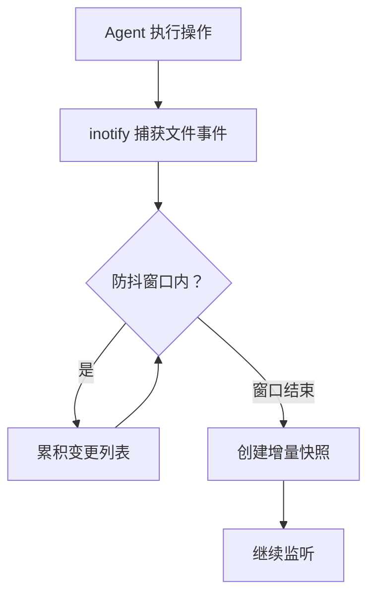
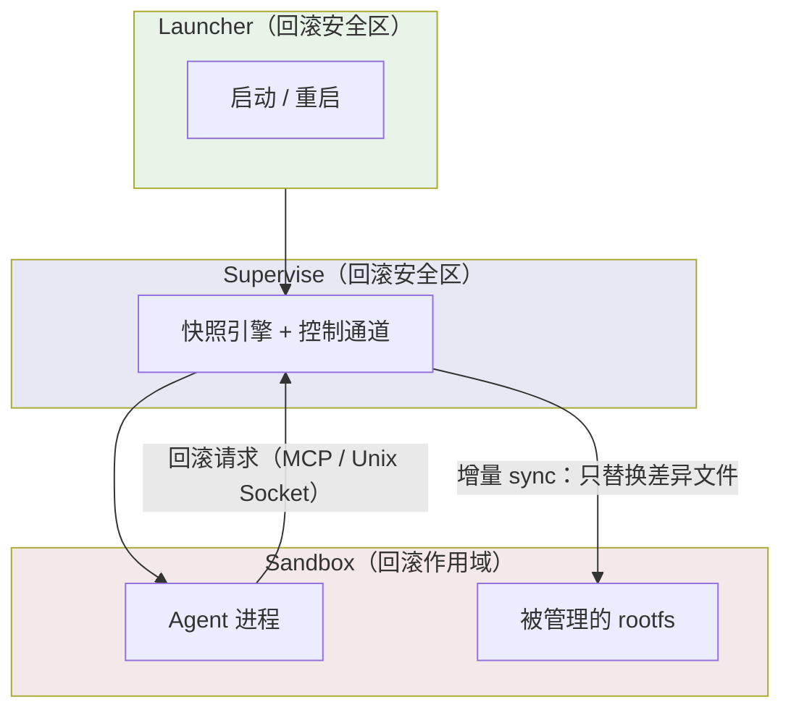
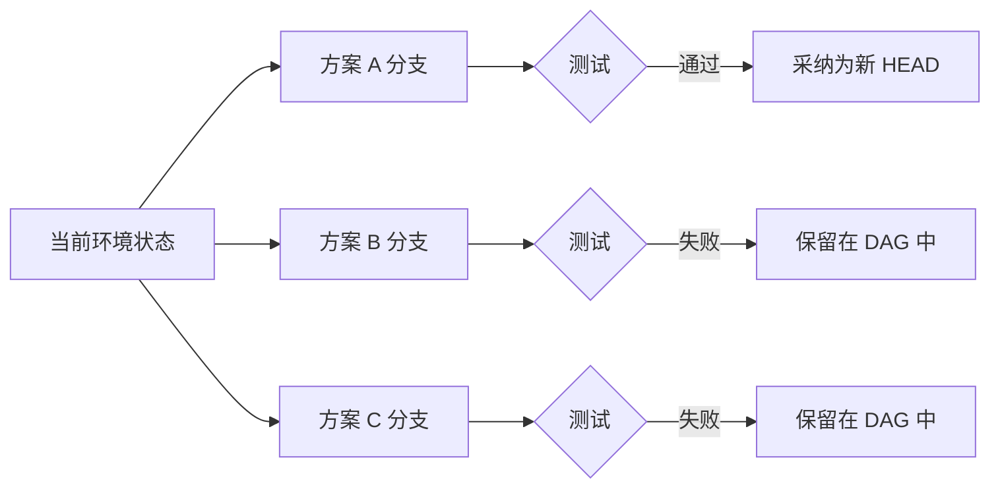

# Agent 时代，最先崩的不是模型，是环境

云原生基础设施在过去十年解决了一个核心问题：**空间隔离**——让不同的工作负载在同一台物理机上互不干扰。Namespace、cgroup、容器、微虚拟机，本质上都在做这件事。

但当 AI Agent 成为环境的主要操作者时，出现了一个新问题：Agent 最需要的能力，不是跟别的工作负载互不干扰，而是在自己搞坏环境之后，能回到之前的某个状态继续工作。

严格说这不是"隔离"——隔离是阻止相互干扰，这里要的是事后能倒带。但两者解决的是同一类事：让一次操作不至于不可挽回。所以请允许我借一个不那么严谨的对仗：空间上互不干扰，**时间上可以回退**。后者正是云原生这十年没怎么碰的一块。

Git 在代码层面解决了倒带问题。但 Agent 搞坏环境的方式，绝大多数不是改代码文件。它装错系统包、改坏全局配置、误删运行时依赖。这些变更散布在整个文件系统中，没有任何现有工具在追踪。

下面的观察来自我们做Aone Agent项目时踩过的坑。

这篇文章想讨论的是：这个缺失是怎么产生的，为什么现有方案填不上，以及填补它时遇到了哪些只有在 Agent 场景下才会出现的问题。

---

## 一、现有方案在解决什么问题

先承认一个事实：行业并非没有意识到 Agent 的环境安全问题。目前的应对大致分两类。

**第一类是行为约束**：通过 Prompt 规则限制高危操作、通过权限缩小操作范围、通过审批流拦截关键命令。这类方案的逻辑是"让 Agent 少犯错"。

**第二类是沙箱隔离**：用虚拟机或Sandbox把 Agent 关在一个环境里，搞坏了重建就行。E2B 用 Firecracker 微虚拟机做到了内存级快照，是这个方向上做得最好的产品。

这两类方案各自有效，但它们解决的是不同的问题：

| 方案类型 | 解决的问题 | 没解决的问题 |
|---|---|---|
| 行为约束（Prompt/权限） | 降低犯错频率 | 犯错后无法恢复 |
| 沙箱隔离（VM/容器） | 爆炸半径控制 | 环境内的状态回退 |
| VM 快照（E2B/Morph） | 环境级快照+回退 | 依赖特定基础设施 |

E2B 的方案最接近完整——它既隔离又可回退。但它的前提假设是你用它的云，或者你的环境有 `/dev/kvm`。这不是 E2B 的问题，是微虚拟机这条技术路线的内在约束。

问题来了：**在不满足这些前提的环境里，Agent 的环境回退能力直接归零**。

---

## 二、卡住所有方案的，是前提假设

把现有的环境回退方案摆在一起，会发现一个规律：

| 技术路线 | 回退能力 | 前提假设 |
|---|---|---|
| Firecracker 微虚拟机 | 内存级快照 | /dev/kvm 或厂商云 |
| btrfs / ZFS 子卷快照 | 文件系统级 CoW | root 权限 + 特定文件系统 |
| Docker checkpoint | 容器级 | Docker daemon + CRIU + root |
| CRIU 进程冻结 | 进程+内存 | root + CAP_SYS_PTRACE |
| Git | 文件级 | 只管被 track 的文件 |

每一个都有明确的能力，但也都绑定了特定的基础设施假设。

在企业 K8s 集群的标准 Pod 里，这些假设几乎全部不满足——非 root 用户（uid 1001）、无 privileged、没有 /dev/kvm、文件系统是 overlay 而非 btrfs。这不是运维偷懒，是 CIS Benchmark、PCI DSS 等安全基线的基本要求。

CNCF 2023 年的调查显示，84% 的组织已在生产使用或正在评估 Kubernetes。当然，"组织用 K8s"不等于"Agent 跑在符合安全基线的受限 Pod 里"——很多 Agent 可能跑在专用 VM 或放宽了权限的节点上。但可以合理推断，**相当一部分企业 Agent 会落在这种受限环境中**，而在这些环境里，所有现有回退方案都不适用。

这个缺口不是某个产品的功能缺失，是基础设施栈的结构性空白。现有方案是为有特权的人类运维设计的：人类运维有 root、能选文件系统、能决定用什么虚拟化技术。**当操作者从人变成了 Agent，"有特权"这个隐含假设就不成立了。**

---

## 三、三个约束条件如何决定方案形态

前两节确定了方向：需要在无特权环境中实现文件系统级的版本控制。但方向不等于方案。从方向到方案之间，有三个约束条件形成了一条推导链——每个约束收窄一次选择空间。需要说明的是，下面每一步其实都有别的选择，我们只是在约束下挑了代价最小的那条；写成"推导"是为了叙述清晰，并不代表只有唯一解。

### 3.1 谁来触发快照——Agent 不会配合

最自然的想法是给 Agent 一个 `save` 工具，让它在关键操作前手动存档。但这条路有两个问题。一是"哪个操作危险"是上下文相关的：`rm -rf build/` 在干净仓库里无害，在错的目录里是灾难；`pip install` 平时安全，恰好覆盖了系统包时就是事故——Agent 在执行的当下并不掌握判断所需的全部状态，指望它在危险操作前主动存档并不可靠。二是更现实的障碍：第三方 Agent（如 Claude Code）的代码不是我们写的，不可能要求它调用存档 API。

Agent 不配合，快照就只能由基础设施自动完成。技术上用 inotify 递归地为每个目录注册 watch、监听文件系统变更，再用防抖策略把一次逻辑操作（比如 `go build` 瞬间产生的几百个文件事件）合并成一次快照。

这就确定了第一个技术选择：**自动捕获，Agent 无需感知**。

### 3.2 自动捕获在哪执行——没有 root 可用

自动捕获需要构建隔离的 rootfs 环境（mount、pivot_root），而第二节的分析表明目标环境没有 root 权限。

在无 root 前提下做这件事，能用的手段不多：FUSE 需要 `/dev/fuse`（受限 Pod 里未必开放），特权 sidecar 违背零特权目标，剩下的就是 Linux User Namespace——普通进程可以在自己创建的用户命名空间里获得隔离的 uid 映射（对外仍是 uid 1001，对内是 root），这个权限刚好够执行 mount 和 pivot_root，且不需要 privileged、不需要 SYS_ADMIN、不需要特殊文件系统，在标准 K8s Pod 里直接可用。它不是唯一可能，而是这些约束下代价最小的一个。

第二个技术选择确定：**用 User Namespace 做无特权隔离**。

### 3.3 自动捕获的频率能否承受——增量是代价最小的路

前两个选择组合在一起，产生了一个新问题：自动捕获意味着高频快照（Agent 每轮操作都可能触发），而一个 rootfs 有几个 GB。如果每次全量复制，磁盘和 IO 会被迅速耗尽。

可选的路子有几条：定期全量加压缩归档，仍有周期性的大开销；写时复制（CoW）文件系统，又把我们绑回特定文件系统，回到第二节的前提陷阱；或者只存差异。我们选了最后者——没变的文件用硬链接指向上一个快照（只新增一个目录项、共享同一份数据块、不复制内容，开销极低），只复制被修改的文件。快照成本跟"改了多少东西"成正比，而非"环境有多大"。

增量设计最初只是为了解决性能问题，但后来发现它同时解锁了一个更关键的能力：**回滚时也只需要替换有差异的文件**。这意味着 Agent 进程的二进制和运行时内存不受影响，进程不需要重启。如果是全量替换，Agent 进程必然被杀。这个特性在下一节变得至关重要。

---

## 四、自助回滚：一个比技术更深的问题

外部触发回滚（人观察到问题 → 手动回退）在很多场景够用。但实践中我们反复观察到一个现象：Agent 往往自己就知道它搞砸了。

模型在执行命令失败后的反思中，经常会说"我之前的操作有误，应该回到之前的状态"。它有回退意愿，但没有回退能力。结果就是在被搞坏的环境上继续修补，越改越乱。

这背后是一个关于**Agent 自主性边界**的问题：如果我们的目标是让 Agent 自主运行复杂任务，那"Agent 不能控制自己的运行环境"就是一个结构性的能力缺陷。自主性要求闭环——感知、决策、执行、纠错都在 Agent 的控制范围内。环境恢复如果必须依赖外部人工介入，这个闭环就是断的。

但自助回滚引入了一个硬约束：当回滚由 Agent 自己发起、又希望它发起后继续工作时，**回滚就不能杀死 Agent 进程本身**。

一个跑了二十轮对话的 Agent，上下文里积累了任务目标、已尝试的方案、失败的原因、当前的思路。如果回滚重启了进程，这些上下文全部丢失。环境坏了可以回退，上下文丢了只能从头开始。

这个约束意味着快照引擎必须在回滚作用域之外——否则回滚会连引擎一起杀掉。而 Agent 又需要通过某种通道主动发起回滚请求。"控制器在回滚范围外"和"Agent 能跨边界发起请求"这两个要求叠加，推导出一个分层结构：

快照引擎和控制通道在回滚作用域之外。在 Agent 自助回滚（self-rollback）模式下，回滚只动 Sandbox 内的文件系统，而且是增量 sync——只替换有差异的文件。Agent 进程不重启，上下文完整保留。需要说明的是，这是 Agent 自助回滚场景下的专有行为；当回滚由外部操作者（人或编排系统）触发时，默认路径仍然是 kill 进程并重新启动——因为外部操作者不需要保留 Agent 的上下文，干净重启反而更安全。

这里还有一个值得展开的细节：从操作系统层面看，如果 Agent 进程持有被替换文件的 file descriptor 或运行时缓存了旧状态（比如 Python 的 `sys.modules`），文件热替换可能导致内存状态与文件系统不一致。这个问题之所以在 Agent 场景中不构成实际障碍，是因为 LLM 驱动的 Agent 的执行模式本身提供了天然的安全边界：Agent 的工作循环是"调用工具 → 读取输出 → 决定下一步"，每一轮都通过工具调用重新读取环境状态，不会跨操作持有长生命周期的文件句柄。回滚发生在两次工具调用之间，Agent 在下一轮自然会读到新的文件内容。

这个架构的关键不在"三层"本身，而在于它背后的判断：**在 Agent 系统中，运行时上下文的价值高于环境状态的价值**。这个优先级决定了回滚必须是非破坏性的。

---

## 五、当操作者从确定性变成概率性

前面几节解决的是能力问题——在无特权环境中实现文件系统级的快照、回滚和 Agent 自助控制。但当 Agent 真正开始高频使用这些能力时，暴露出一类不同性质的问题：现有基础设施的接口契约是为确定性调用者设计的，**当调用者变成概率性的 LLM，契约本身开始失效**。

### 5.1 错误处理契约的失效

（这一条乍看和环境回退无关，但其实在同一根链子上：回滚本身也是一次工具调用，如果模型连"回滚失败了"都会忽略，自助回滚就不可靠——所以它对我们不是题外话。）

传统工具的错误返回是为确定性调用者设计的：函数返回错误码，调用者按分支逻辑处理。这个契约的隐含假设是**调用者会理性地处理每一种返回值**。

LLM 不是这样工作的。它是自回归生成——下一个 token 的概率分布受上下文中前面所有 token 的影响。我们观察到的一个现象是：当上下文里前几次工具调用都成功时，即使某次返回了明确的错误信息，模型仍然可能生成"操作成功"的后续文本。一个可能的解释是，成功模式在上下文中形成了较强的统计先验，压过了单次错误返回的信号——但这个因果机制目前没有严格的实验验证，更多是基于行为观察的推断。

这不是 Prompt 能解决的问题。Prompt 在"决定是否调用工具"阶段对模型有较强的控制力，但在"解释工具返回值"阶段，自回归的惯性力量更大。

推广来看：**所有把工具暴露给 LLM 的系统，都面临这个接口契约错配。** 在 Agent 环境管理的实践中，我们做了一个初步尝试：在工具的错误返回中强制添加结构化的中断信号（大意是"工具未执行，不要编造结果，原样报告错误"），试图在模型最容易产生惯性幻觉的位置硬插提醒。这在实际使用中降低了错误忽略率，但远不是一个完备的解决方案——它本质上仍然是在用自然语言试图约束概率生成过程，有效性取决于具体模型和上下文长度。更根本的解法可能需要在工具协议层面（如 MCP）定义专门的错误语义，让模型在架构层面而非语义层面感知到异常。这是整个 Agent 工具生态需要共同探索的方向。

### 5.2 "记录一切"假设的失效

自动捕获的初始设计思路是"记录一切，需要时检索"。这在确定性系统里是合理的——日志越完整越好，查问题时用工具过滤就行。

但 Agent 查看自己操作历史的方式不是 grep，是把历史节点列表放进上下文让模型理解。当历史中充斥着编辑器临时文件、Agent 状态文件、包管理器缓存产生的无意义快照时，**噪音不是浪费磁盘，而是直接降低模型的决策质量**。Agent 无法从满屏噪音中识别关键分叉点，导致回滚到错误的节点。

这跟传统系统中"日志太多"是不同性质的问题。传统系统中日志噪音增加的是搜索时间，Agent 系统中噪音降低的是**决策准确性**。信噪比从运维指标变成了功能指标。

### 5.3 存储增长速率的假设失效

人类运维操作环境的频率是每天几次到几十次。基于这个频率设计的快照存储策略（比如每天保留 N 个检查点）完全够用。

Agent 操作环境的频率是每小时几十到几百次。一天的自动快照可以积累数百个节点。全保留磁盘不够，简单保留最近 N 个可能丢失关键分叉点。

我们借鉴了 DVR（数字录像机）的稀疏保留策略：近期全留，远期按指数间隔稀疏化，分叉点和用户标记永远不删。被清理的节点，子节点自动重挂到上级，DAG 结构保持连通。

这三个问题看似各自独立，实际指向同一个判断：给 Agent 用的基础设施不能照搬现有设计。错误通信、信息呈现、资源管理的底层假设都需要为概率性调用者重新设计。

---

## 六、回退能力改变了什么

到目前为止，文章一直在讨论"怎么让 Agent 的环境能回退"。但更值得思考的问题是：**当环境可回退成为默认能力后，Agent 的使用方式会发生什么变化？**

最直接的变化是**风险评估的逻辑变了**。

在环境不可回退时，给 Agent 的每一条指令都需要评估"如果它搞砸了怎么办"。这导致了两种极端：要么给 Agent 非常保守的权限（能力受限），要么在出事后花大量人力善后（成本高昂）。很多团队卡在这两端之间反复权衡，本质上是因为**犯错的代价太高，而犯错又不可避免**。

环境可回退把犯错的代价从"重建环境"降到了"回退到上一个快照"。这不是量变，是质变——它让"让 Agent 大胆尝试"变成了一个理性的策略选择，而不是鲁莽的冒险。

更深一层，回退能力解锁了一种全新的工作模式：**环境级的分支探索**。

Git 的分支让开发者可以同时探索多条代码路径，挑选最优的合入主线。同样的逻辑在环境层面也成立——从当前环境状态 fork 出多个副本，在每个副本里尝试不同的方案，用测试结果决定保留哪个。我们在 agentenv 中把这个模式实现为 tournament：

这不是一个锦上添花的功能。对于 Agent 来说，试错是基本工作模式，而不是异常情况。**当试错可以并行化、且失败的分支不会污染主线时，Agent 的问题解决效率发生了根本性的变化**——从线性试错（试一个 → 失败 → 回退 → 试下一个）变成并行探索（同时试 N 个 → 留最好的）。

这种变化在人类工程师的工作模式中没有直接对应物——git worktree、CI matrix 勉强算近似，但人不会真的同时开三个环境、装三种方案、再挑一个能跑通的，成本太高。对 Agent 来说这却是自然的工作方式，前提是基础设施支持环境级的分支和合并。

---

## 七、一个更大的问题

环境版本控制是一个具体的缺失，但它背后指向的是一个更大的问题：**现有基础设施栈的设计假设，系统性地不适配 AI Agent 作为操作者的场景**。

这些假设至少包括四条：

| 隐含假设 | 人类运维 | AI Agent |
|---|---|---|
| 操作频率 | 每天几次到几十次 | 每小时几十到几百次 |
| 操作可预测性 | 有计划、有审批 | 试错式、不可预测 |
| 错误处理方式 | 看日志 → 人工判断 → 手动恢复 | 自回归生成 → 可能忽略错误 → 需要自主恢复 |
| 权限模型 | 有 root = 被信任 | 无 root、不能被信任、但需要操作能力 |

环境版本控制是第一条和第二条假设失效后暴露出的缺失。第五节讨论的接口契约问题是第三条假设失效的表现。第四条——权限模型——可能是影响最深远的：现有基础设施的安全模型建立在"有权限的人知道自己在做什么"的基础上，而 Agent 恰恰是"有操作需求但不一定知道自己在做什么"的调用者。

这四条假设不是独立失效的，它们之间有连锁关系。操作频率高导致需要自动化快照（人工来不及）；不可预测导致快照必须无差别覆盖（不知道哪次操作会出问题）；自主恢复要求工具接口为概率性调用者重新设计（传统错误处理对 LLM 不可靠）；无特权要求整套机制在没有 root 的情况下工作（不能为了管理能力放弃安全基线）。

这意味着 Agent 基础设施不是在现有栈上"加一层"就够的。**从接口契约到信息呈现到资源管理，每个层面都需要重新审视"操作者是人"这个默认假设。** 环境版本控制只是这个系统性问题中最先暴露、最容易验证的一个切面。

监控告警是另一个例子：现有的告警系统假设接收者是人（看到告警 → 判断严重性 → 决定行动），当接收者变成 Agent 时，告警信息的格式、优先级表达方式、上下文携带量都需要重新设计。部署流水线也是：CI/CD 假设触发者是确定性的代码提交事件，当触发者变成 Agent 的试错行为时，流水线的频率控制、失败回滚策略、资源分配都需要调整。

这些问题还没有被系统性地提出，更没有被系统性地解决。一个值得追问的问题是：**为什么？**

### 7.1 错配为什么长期存在

一个重要原因是**社区的分隔**。建设云原生基础设施的人（CNCF、K8s 社区、SRE 群体）和建设 AI Agent 的人（ML 研究者、Agent 框架开发者）基本是两个不重叠的圈子。

云原生社区关心的是"怎么可靠地运行工作负载"，工作负载对他们来说是黑盒——不管里面跑的是 Web 服务还是 AI Agent，调度、隔离、网络、存储的需求看起来没有本质区别。Agent 社区关心的是"怎么让模型更聪明地完成任务"，基础设施对他们来说也是黑盒——只要环境能跑起来就行，至于环境坏了怎么办，那是运维的事。

**双方都在各自的抽象层内优化，没有人在审视抽象层之间的接口。** 环境版本控制恰好落在这个接口的缝隙里——它既不是纯粹的基础设施问题（需要理解 Agent 的行为模式才能设计），也不是纯粹的 AI 问题（需要系统编程能力才能实现）。

另一个原因是**Agent 的自主性还不够高，问题还没疼够**。今天大多数 Agent 的使用模式仍然是人在环路中（human-in-the-loop）：人给指令、Agent 执行、人检查结果。在这种模式下，环境坏了人可以手动介入，痛感不强。但随着 Agent 从 Copilot 模式走向自主模式（Agent 自己规划、自己执行、自己纠错），人工介入的频率会迅速下降，环境恢复能力的缺失会从"偶尔的不便"变成"系统性的瓶颈"。

### 7.2 Agent 环境管理的探索能提炼出什么

回顾前面几节讨论的设计决策，有几条原则反复出现，它们可能适用于更广泛的 Agent 基础设施设计：

**恢复优先于预防。** 概率性系统一定会犯错，这是统计规律而非工程缺陷。与其投入无限精力降低错误率，不如把犯错的代价降到足够低。这跟分布式系统设计中"为故障设计（design for failure）"是同一种思维方式，只不过故障源从硬件和网络变成了模型的概率性输出。

**零侵入是硬约束，不是偏好。** Agent 生态正在快速分化——Claude Code、Devin、Cursor、自研 Agent 各有各的架构。任何要求 Agent 端配合的方案，都会在集成阶段遭遇 N 种 Agent × M 种要求的组合爆炸。基础设施必须单方面完成自己的职责，不能假设对方会配合。

**信息呈现影响决策质量。** 这是最容易被忽视的一条。传统基础设施的信息输出是给人看的（日志、Dashboard、告警邮件），设计目标是"信息完整"。但 Agent 消费信息的方式不同——信息进入上下文窗口后直接影响模型的下一步决策。过多的噪音不只是浪费 token，而是会系统性地降低决策准确度。**给 Agent 用的接口，信噪比是功能指标，不是体验指标。**

**频率改变架构。** 人的操作频率下，很多设计问题不存在——全量快照够用、线性日志够用、每天清理一次够用。Agent 的操作频率把这些"够用"全部打破。增量快照、噪音过滤、稀疏保留这些设计不是优化，是在新频率下的生存条件。类比一下：批处理系统的架构和实时系统的架构不是一回事，不是因为它们处理的数据不同，而是因为频率不同。

### 7.3 这个问题会怎么演变

Agent 的自主性正在沿着一条清晰的路径递进：

- **Copilot 阶段**（当前主流）：人给指令，Agent 执行单步操作，人检查每一步结果。环境坏了人来修——痛，但能忍。
- **自主 Agent 阶段**（正在到来）：Agent 接受高层任务，自己规划和执行多步操作，出错自己纠正。环境坏了如果不能自主恢复，任务就中断——开始影响可用性。
- **多 Agent 协作阶段**（已有雏形）：多个 Agent 在同一个或关联的环境中工作，需要隔离各自的影响、共享某些状态、协调环境变更。环境管理的复杂度从单 Agent 的"线性历史"变成多 Agent 的"DAG 交织"——现有基础设施完全没有为此做过准备。

每一步递进，都会让本文讨论的四条假设错配变得更严重。Copilot 阶段的痛点是"手动恢复太慢"，自主 Agent 阶段的痛点是"没人恢复了"，多 Agent 阶段的痛点是"不知道该恢复到哪里"。

如果基础设施不跟上这个演进速度，行业会被迫做出一个不幸的选择：**要么限制 Agent 的自主性来适应现有基础设施，要么承受频繁的环境事故**。两个选项都意味着 Agent 的价值不能被充分释放。

---

## 八、为 Agent 重新设计基础设施

过去十年，云原生运动重新定义了"怎么运行软件"——容器化、编排、不可变基础设施、声明式配置。这套体系的成功建立在一个前提上：操作者是人类工程师，他们有特权、有计划、有判断力、操作频率低。

现在操作者正在变成 AI Agent。它们没有特权、行为不可预测、判断力受限于上下文窗口、操作频率高出两个数量级。这不是"用户群体扩大了"——这是操作者的基本特性变了。

类比一下：移动互联网不是"屏幕变小的桌面互联网"。当交互方式从键盘鼠标变成触屏手指时，整个 UI 范式需要重新设计——不是把桌面界面缩小就行。同样的道理，Agent 时代的基础设施不是"加了几个 API 的云原生基础设施"。当操作者从确定性的人变成概率性的模型时，从接口契约到信息呈现到资源管理，设计假设需要从根基上重新审视。

这个转变还处于非常早期的阶段。环境版本控制是我们最先遇到、也最先动手填补的一个空白，实践整理为开源项目 [agentenv](https://github.com/css521/agentenv)——在标准 K8s Pod 中以非 root 身份提供文件系统级的快照、回滚和分支探索（Go 实现，支持 CLI / Unix Socket / HTTP+OpenAPI / MCP）。但正如前面分析的，这只是整个问题的一个切面。监控告警、部署流水线、权限模型、日志系统——每一个基础设施组件都值得用"操作者是 Agent 而非人类"的视角重新审视。

谁来做这件事？大概率不是某一个团队或某一个项目。云原生基础设施的繁荣来自一个开放社区围绕共同问题的持续协作。Agent 基础设施可能需要同样的过程——只不过这一次，需要基础设施社区和 AI 社区真正坐到同一张桌子前。具体可以从两件小事起步：基础设施侧把错误语义做进协议（比如在 MCP 层定义明确的失败信号），并把"信噪比"当成接口的功能指标来对待；Agent 框架侧则可以开始假设"环境是可回退的"，据此设计更激进的重试与并行探索策略。

项目地址：[github.com/css521/agentenv](https://github.com/css521/agentenv)
